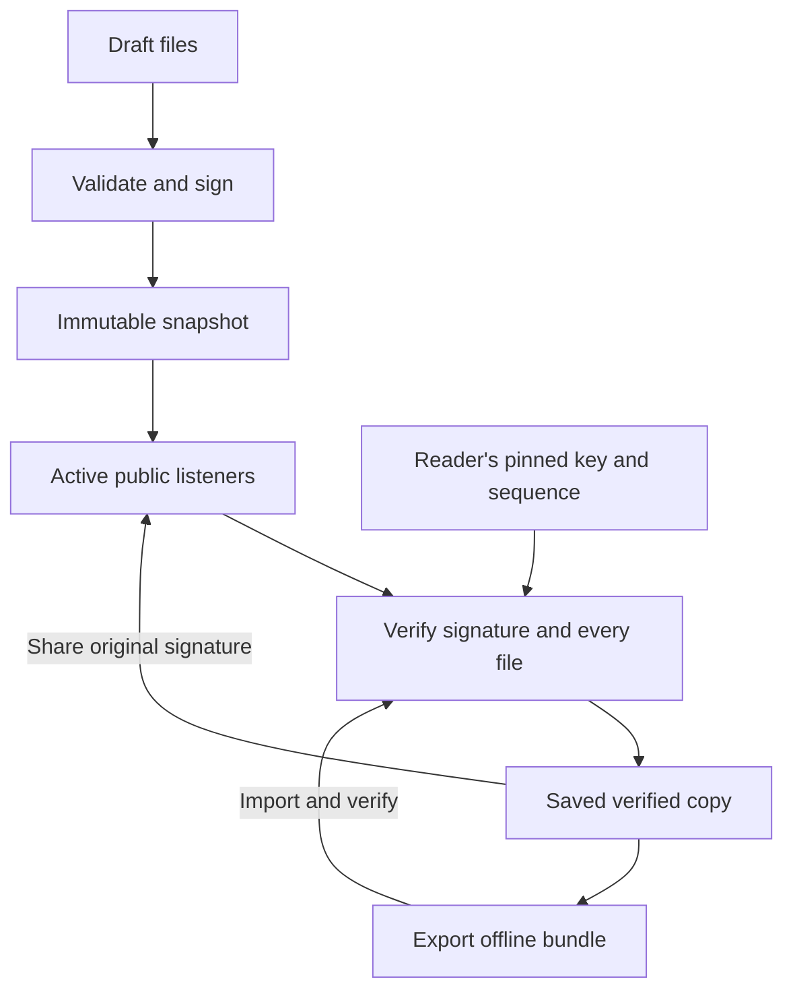

# GLOWMESH

### Your site. Your keys. Many ways home.

**A small Rust webserver for people who want to publish, keep, and share a piece of the web.**

Glowmesh brings local hosting, Tor onion services, Yggdrasil connectivity, signed replicas, and offline bundles into a friendly browser control panel. Write a page, choose your connections, and keep verified copies of the things you care about.

Created by **Luminosity**, with **GPTeus**.

**[Download Glowmesh 0.3 — all platforms](downloads/Glowmesh_0.3.0_All_Platforms.zip)** · **[Start here](#start-here)** · **[Inside the technology](#inside-the-technology)** · **[Support: Cash App $unixarcade](https://cash.app/$unixarcade)**

Windows x64 · Apple silicon Mac · Intel Mac · Linux x64 · Raspberry Pi ARM64 / ARMv7

---

## Why this exists

A website becomes more useful when people can reach it through several routes and keep a copy when those routes disappear. A small computer should be able to participate. Publishing should feel approachable, and a reader should be able to verify who signed the content they received.

Glowmesh puts those ideas into a concrete system:

- **Several paths to the same content:** local access, an onion address, and a connected Yggdrasil interface.
- **An identity that travels with the site:** a pinned Ed25519 publisher key and signed, versioned manifests.
- **Copies that remain useful offline:** local previews and portable `.gmb` bundles.
- **Sharing that preserves authorship:** serve another publisher's verified snapshot under its original signature.
- **Small-machine operation:** the same interface with tighter limits and manual updates.

You choose the publishers and routes. Tor and Yggdrasil supply their networking; Glowmesh manages publishing and content verification. Onion addresses and literal mesh IP addresses provide paths that do not depend on conventional DNS. Ordinary hostname routes still use DNS. There is no built-in global name registry, DHT discovery, or guarantee of a connection during a complete network shutdown.

## Start here

1. **[Download the all-platform ZIP](downloads/Glowmesh_0.3.0_All_Platforms.zip)** and extract it completely.
2. Open the launch file for your computer. The included executables need no Rust or Node installation.
3. In the panel, write a heading and some words. Choose **Save page draft**, then **Publish changes**.

| Computer | Normal launch | Low Resource launch |
|---|---|---|
| Windows 10/11, Intel/AMD 64-bit | Double-click `Start_Glowmesh.cmd` | `Start_Low_Resource.cmd` |
| Mac, Apple silicon or Intel; macOS 11.7.1+ | Open `Start_Glowmesh.command` | `Start_Low_Resource.command` |
| Linux x86_64 | `sh ./Start_Glowmesh.sh` | `sh ./Start_Low_Resource.sh` |
| Pi / ARM Linux, ARM64 or ARMv7 hard-float | `sh ./Start_Glowmesh.sh` | `sh ./Start_Low_Resource.sh` |

The launcher opens your existing browser. If it cannot, copy the private link printed in its terminal. Keep that terminal open; **Ctrl-C** stops the server. Windows/Mac downloads are not publisher-signed; the [installation guide](docs/INSTALL.md) covers first-open behavior.

The source tree in this repository is for inspection and source builds. The downloadable ZIP contains the ready-to-run binaries and launchers. Original ARMv6 Pi 1 / Pi Zero machines need a different build; Zero 2 W is a newer architecture. See [the Pi guide](docs/LOW_RESOURCE.md).

### Choose a connection

| Connection | What it gives you | What it needs |
|---|---|---|
| This computer | Local publishing and offline reading immediately | Glowmesh running |
| Tor onion | A persistent `.onion` identity without buying a domain | Installed Tor; visitors use Tor Browser |
| Yggdrasil | A listener on an existing mesh IPv6 address | Yggdrasil installed and connected on both sides |
| Offline bundle | A verified copy carried on USB or through a file transfer | A `.gmb` file and publisher-key confirmation |

Tor and mesh begin **off** at each app launch. Enable them in **Connections**. Tor publishing and downloading through Tor are separate: publishing starts a managed Tor process; onion downloads require a local SOCKS endpoint configured in the panel. See [network setup](docs/NETWORKS.md).

## Everyday controls

| Task | In the panel |
|---|---|
| Make a page | Write plain text; save the draft; publish |
| Bring an existing website | Upload files or a folder into the draft |
| Reach more people | Enable Tor and/or select your mesh interface |
| Keep a friend's site | Inspect its address, compare the full publisher key, confirm |
| Update a saved copy | Choose **Update now**, or enable automatic checks in standard mode |
| Carry content offline | Export/import a public `.gmb` bundle |
| Help a site stay available | Choose **Share this copy**; its original signature stays intact |
| Return to your own page | Choose **Share my site**, or publish your draft |

Draft changes remain separate from the published snapshot. A failed publication or failed copy verification leaves the previous published/saved version available. A multi-file draft upload is a sequence of file updates; **Publish** creates the complete snapshot you want people to see.

## Inside the technology

### 1. A Rust runtime with a small browser interface

Tokio runs the asynchronous networking and process lifecycle. Hyper handles HTTP/1. The public server serves immutable `Bytes` buffers from a site map shared through `Arc`, so accepted requests read a prepared snapshot instead of reopening arbitrary filesystem paths.

The interface is embedded vanilla HTML, CSS, and JavaScript. It uses your existing browser; no Electron runtime, JavaScript package installation, remote UI assets, or cloud account is needed to operate the app. The Rust application forbids unsafe code in its own crate; dependencies provide the necessary lower-level platform integrations.

Standard mode creates two Tokio runtime workers. Low Resource uses a current-thread runtime. Blocking helper threads may still be created when needed. Site loading and signing can occupy a runtime worker, so content limits and modest workloads remain part of the design.

### 2. An identity independent of the serving address

The publisher identity comes from a private random **32-byte Ed25519 seed**. Its public verifying key is represented as **64 lowercase hexadecimal characters**. The onion identity is a separate key: you can change where a signed site is served while readers continue verifying its publisher.

A signed manifest contains a format identifier, publisher key, title, positive sequence number, and an ordered list of file paths, byte lengths, and SHA-256 hashes. The envelope includes the Ed25519 signature. Glowmesh signs a domain-separated message:

```text
ASCII "Glowmesh signed snapshot v1" + zero byte + typed compact manifest JSON
```

The manifest serialization follows the Rust data structure's field order and `serde_json` escaping. Files are sorted by their UTF-8 paths. This is a precisely defined typed encoding, not RFC 8785/JCS. The verifier rejects unknown/duplicate fields, reconstructs the signed bytes, verifies the signature strictly, and checks each file's length and hash.

For an interoperable client, use the exact byte rules in [PROTOCOL.md](docs/PROTOCOL.md); visually similar JSON is not sufficient.

### 3. Verification before replacement

Readers confirm the publisher's full public key through a channel they trust. After that first pin, every update must retain the identity and satisfy the stored sequence rules:

| Incoming version | Result |
|---|---|
| Higher sequence, valid signature/files | Accepted |
| Same sequence, identical typed manifest | Accepted as the same version |
| Same sequence, changed manifest | Rejected |
| Lower sequence | Rejected |
| Different publisher key | Rejected |
| Corrupt/truncated content or invalid paths | Rejected |

This prevents rollback relative to a reader's retained history. It does not prove that an initial valid copy is the newest version in the world. Removing a saved publisher removes that local pin/history. A signature establishes authorization by a key; it does not establish that a page's content or JavaScript is trustworthy.



### 4. Explicit routes with bounded failure handling

A saved publisher can have **up to six HTTP(S) root addresses**. Glowmesh tries them in order, checking that each candidate serves the expected signed identity. A failed route can be followed by another supplied route. There is no background peer discovery or consensus mechanism.

The fetcher uses reqwest with rustls/ring and bundled WebPKI roots. It ignores proxy environment variables, follows no redirects, accepts no URL credentials, requests no compression, and bounds streamed response bodies. Connections have a 12-second timeout, requests a 45-second timeout, and each complete route attempt a 120-second deadline. HTTP 429 responses permit up to three bounded retries with 1–5 second pauses inside that route deadline.

Onion requests use **SOCKS5h**, passing the hostname to a local Tor proxy for resolution. They do not fall back to a direct connection. Mixing onion and direct addresses for one publisher requires explicit opt-in. Direct routes expose the usual source-network address; publishing the same key/content through several transports links those public identities.

### 5. Small public protocol surface

In `app` mode, public listeners and saved previews expose:

| Endpoint | Purpose |
|---|---|
| `/__glowmesh/manifest.json` | Signed manifest envelope |
| `/__glowmesh/blob/<sha256>` | Raw bytes of a signed file |
| Ordinary site paths | Published HTML, CSS, JavaScript, images, and other files |

Public requests use GET/HEAD with Host validation, timeouts and connection/rate limits. There is no public upload, management API, open proxy, CGI, or directory listing. Blob hashes identify content inside a snapshot; this release does not implement a global content store, retained blob history, or delta synchronization.

The legacy `serve` command is a separate single-listener static mode. Use **`app`** for the browser panel, simultaneous connections and signed-copy protocol.

### 6. Offline bundles with a deliberately simple format

A `.gmb` file contains:

| Part | Encoding |
|---|---|
| Magic | Eight ASCII bytes: `GLOWMB01` |
| Envelope length | Four-byte unsigned big-endian integer |
| Envelope | UTF-8 signed-manifest JSON |
| Content | Raw file bytes concatenated in manifest order |

The envelope is capped at 4 MiB; independent content/count limits also apply. Parsing rejects trailing bytes, truncation, invalid signatures, bad hashes and unsafe paths. Bundles contain no compression, filesystem links, permissions or private signing/onion keys. They are public-content packages, not encrypted backups.

Glowmesh verifies bundles into in-memory snapshots instead of extracting arbitrary paths into the filesystem. A saved copy can be previewed offline, exported again, or shared through the holder's active connections under the original publisher's signature.

### 7. Management separated from public content

The control panel binds only to **`127.0.0.1`**, on a port separate from every public site and saved preview. Each launch creates a fresh **256-bit bearer token**, initially delivered in the private link's URL fragment. The UI moves it into tab `sessionStorage` and removes the fragment from the visible address. Restarting invalidates the session.

API calls require constant-time token comparison and an exact numeric Host. Mutations also require the matching Origin. CORS and cookie authentication are not enabled. Untrusted names/errors render through `textContent`. Saved pages run on separate origins and receive no management token.

One mutation runs at a time; conflicting writes receive HTTP 409. The status view can return cached state during a longer operation. Standard mode bounds the panel to 16 active connections; Low Resource reduces that to four. The browser's same-origin policy and the operator's trusted account remain part of this boundary.

### 8. Filesystem and process boundaries

Capability-relative reads confine site loading to the selected content tree. Path checks reject traversal, hidden components, encoded separators, ambiguous syntax, reserved control paths, and Windows device names on every platform. File count, byte count, depth and path length are bounded.

Private state is disjoint from public content. Unix uses ownership checks and private file/directory modes. Windows uses protected ACLs granting the current user and SYSTEM access, with reparse-point and hard-link checks. One exclusive state lock prevents concurrent writers.

Snapshots/settings use private temporary files, file sync, and replacement rename. Unix also syncs the parent directory; Windows does not perform that Unix directory operation. Content and settings are separate commits, and listener swaps occur sequentially rather than as one transaction across every connection.

Managed Tor is launched without a shell, with quoted paths and separate state. Its publishing instance exposes no SOCKS or control listener. The HTTP backend is a private Unix socket on Mac/Linux and dynamic loopback TCP on Windows. Shutdown stops and reaps the child; a failed onion connection leaves the app's other connections available.

## Low Resource mode

Use the matching **Start_Low_Resource** launcher, or add `--low-resource` when running the executable. The cryptographic and management checks stay the same.

| Budget | Standard default | Low Resource maximum |
|---|---:|---:|
| One file | 32 MiB | 2 MiB |
| One site | 256 MiB | 8 MiB |
| Files per site | 10,000 | 512 |
| Saved publishers | 8 | 2 |
| Stored bundles in total | 512 MiB | 32 MiB |
| Public connections per listener | 128 | 16 |
| Public requests/second per listener | 100 | 20 |
| Burst per listener | 200 | 40 |
| Panel connections | 16 | 4 |
| Async runtime workers | 2 | 1 |
| Saved-copy automatic checks | Optional, once per minute | Manual **Update now** |

Stricter configuration values remain stricter. Low Resource is applied at runtime; it does not rewrite TOML. Its launcher uses a separate `my-site-lite` starter folder. Multiple snapshots, transfers and old responses can coexist in RAM, so these budgets are not a hard memory cap. Browser, Tor and Yggdrasil consumption is additional.

The app's visible panel polls status every ten seconds and pauses polling while hidden. This repository's **public homepage** has no JavaScript or polling at all. Its download is fetched only when a visitor chooses it.

## Keep your identity

| Platform | Normal launcher's default site folder |
|---|---|
| Windows | `%LOCALAPPDATA%\Glowmesh\my-site` |
| Mac | `~/Library/Application Support/Glowmesh/my-site` |
| Linux / Pi | `${XDG_DATA_HOME:-$HOME/.local/share}/glowmesh/my-site` |

Set `GLOWMESH_SITE` to choose another folder. Stop the app before making a private backup of the entire site directory, including `.glowmesh/`. Keep the signing key and latest published version together. Public bundles are for sharing; the private directory contains the keys that preserve your identities.

## Build and inspect

Install Rust 1.94+ and a platform C toolchain, then from this repository:

```sh
cargo build --release --locked
./target/release/glowmesh --config my-site/glowmesh.toml app
```

On Windows run `target\release\glowmesh.exe`. For the smaller profile:

```sh
./target/release/glowmesh --low-resource --config my-small-site/glowmesh.toml app
```

`Cargo.lock` pins the dependency resolution. First source compilation needs crate downloads. Full build/test instructions are in [DEVELOPMENT.md](docs/DEVELOPMENT.md). The prebuilt release uses thin LTO, one codegen unit and stripped output. Linux targets link musl statically; Mac uses system libraries; Windows x64 uses Windows system DLLs.

### Source map

| File | Responsibility |
|---|---|
| [main.rs](src/main.rs) | CLI, runtime selection, starter creation and legacy serving |
| [config.rs](src/config.rs) | TOML, validation and resource budgets |
| [site.rs](src/site.rs) | Capability-relative loading, path validation and static snapshots |
| [http.rs](src/http.rs) | Public responses, HTTP restrictions and rate limits |
| [signed.rs](src/signed.rs) | Keys, typed manifests, signatures, bundles and persistence |
| [peers.rs](src/peers.rs) | Route validation, SOCKS5h and bounded verified downloads |
| [routes.rs](src/routes.rs) | Independent local/onion/mesh listeners and snapshot swaps |
| [panel.rs](src/panel.rs) | Authenticated API, drafts, saved sites and update scheduling |
| [onion.rs](src/onion.rs) | Tor configuration and owned subprocess lifecycle |
| [platform.rs](src/platform.rs) / [windows_state.rs](src/windows_state.rs) | OS listeners/events and Windows private-state protection |
| [state.rs](src/state.rs) | Private directories/files and exclusive locking |
| [assets](assets/) / [tests](tests/) | Embedded interface and test suites |

### Verification, with scope

The 0.3 release recorded **38 passing Linux Rust/HTTP/app tests**, plus **four app scenarios on each ARM target under QEMU**. UI interactions passed with live API processes in both profiles. Strict Clippy passed for Linux and Windows targets. RustSec scanning found zero known advisories or warnings in the lockfile on the recorded scan.

Windows/Mac binaries were cross-compiled and inspected; native execution remains untested. ARM checks used emulation rather than physical Pis. Two Unix-socket tests were explicitly skipped by the build environment. No live Tor/Yggdrasil reachability or full browser-layout verification was performed. [VERIFICATION.md](VERIFICATION.md) records versions, dates and exact coverage; [SECURITY.md](SECURITY.md) describes the trust boundaries.

The CI workflow in this GitHub kit is **manual** (`workflow_dispatch`), so README/homepage changes do not trigger Rust compilation. GitHub Pages performs its own small static deployment.

## Put this project on GitHub Pages

This repository includes a lightweight public **`index.html`** and **`.nojekyll`**. It uses system fonts, embedded CSS, native disclosure controls, no JavaScript, no CDN assets and no analytics code.

1. Upload the contents of this kit to your repository root, preserving `downloads/` and the source/doc folders.
2. Open **Settings → Pages → Deploy from a branch**.
3. Select **main → /(root)**, then **Save**.

The download button uses a relative path, so the repository may have any name. If you choose `Glowmesh` under `unixarcade`, the expected Pages address is `https://unixarcade.github.io/Glowmesh/` after deployment. Use the actual published address shown by GitHub.

GitHub Pages serves the public homepage and files. Run the Rust server on your computer or another host for local management, onion publishing and mesh connections. Keep personal site folders and private keys out of the public repository. Setup details: [GITHUB_PAGES.md](GITHUB_PAGES.md), [GitHub publishing-source documentation](https://docs.github.com/en/pages/getting-started-with-github-pages/configuring-a-publishing-source-for-your-github-pages-site).

## Creator links

One project in a larger body of software, cinema, music, writing and experiments by **Luminosity**.

| Find / support the work | Link |
|---|---|
| **Support — Cash App $unixarcade** | **https://cash.app/$unixarcade** |
| GitHub — unixarcade | https://github.com/unixarcade |
| YouTube — Matthew Kowalski / Luminosity | https://www.youtube.com/@MatthewKowalskiLuminosity |
| LiveJournal — Luminosity | https://luminosity.livejournal.com/ |
| Forge AI OS | https://luminosity.gumroad.com/l/fyosxi |
| Gumroad products / account portal | https://gumroad.com/products |
| Books I Have Written — Goodreads | https://www.goodreads.com/review/list/1550470-matthew-kowalski?ref=nav_mybooks&shelf=books-i-have-written |
| Watch GhostLine Chorus | https://unixarcade.github.io/GhostLineChorus/ |
| GhostLine Chorus source | https://github.com/unixarcade/GhostLineChorus |

### [Help keep the little lights on — Cash App $unixarcade](https://cash.app/$unixarcade)

Support more independent software, films, music, books and strange luminous machines. Share the project, report a reproducible bug, test a native build, improve the docs, or help fund the next release.

## Guides and license

[Install](docs/INSTALL.md) · [App guide](docs/APP.md) · [Low Resource / Pi](docs/LOW_RESOURCE.md) · [Networks](docs/NETWORKS.md) · [Configuration](docs/CONFIGURATION.md) · [Operations](docs/OPERATIONS.md) · [Protocol](docs/PROTOCOL.md) · [Security](SECURITY.md) · [Verification](VERIFICATION.md) · [Third-party notices](THIRD_PARTY_NOTICES.md)

Glowmesh is [MIT licensed](LICENSE). Copyright © 2026 Luminosity. Preserve the license and attribution when distributing copies. Dependency licenses remain with their respective authors.

**Little lights. Many paths.**
